## **<center>Jobsheet 5</center>**

><p>Nama : Bagus Dwi Putranto<p>
>Kelas : 1F D4 TI<p>
>Nomer Absen : 08<p>
>NIM : 2141720079<p>

<br>

### 5.1 Tujuan Praktikum
Setelah melakukan praktikum ini diharapkan mahasiswa mampu:
* Mahasiswa mampu membuat algoritma searching bubble sort, selection sort dan
insertion sort
-  Mahasiswa mampu menerapkan algoritma searching bubble sort, selection sort
dan insertion sort pada program

---
### 5.2 Mengurutkan Data Mahasiswa Berdasarkan IPK Menggunakan Bubble Sort
Perhatikan diagram class Mahasiswa di bawah ini! Diagram class ini yang selanjutnya akan dibuat sebagai acuan dalam membuat kode program class Mahasiswa.

Berdasarkan class diagram di atas, kita akan membuat sebuah class Mahasiswa yang
berfunsi untuk membuat objek mahasiswa yang akan dimasukan ke dalam sebuah array.
Terdapat sebuah konstruktor berparameter dan juga fungsi tampil() untuk menampilkan
semua attribute yang ada.

Selanjutnya class diagram di atas merupakan representasi dari sebuah class yang berfungsi untuk melakukan operasi-operasi dari objek array mahasiswa, misalkan untuk menambahkan objek mahasiswa, menampilkan semua data mahasiswa, dan juga untuk mengurutkan menggunakan Teknik bubble sort berdasarkan nilai IPK mahasiswa.

---
#### 5.2.1 Langkah-langkah Percobaan
1. Buat project baru dengan nama “bubble-selection-insertion”, kemudian buat package dengan nama “jobsheet6”.
2. Buatlah sebuah class dengan nama Mahasiswa
3. Sesuaikan class Mahasiswa dengan melihat class diagram di atas dengan menambahkan
attribute, konstruktor, dan fungsi atau method. Untuk lebih jelasnya class tersebut dapat dilihat pada potongan kode di bawah ini
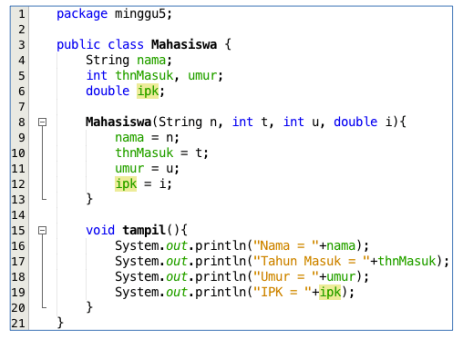
4. Buat class DaftarMahasiswaBerprestasi seperti di bawah ini!
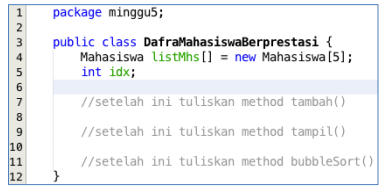
5. Tambahkan method tambah() di dalam class tersebut! Method tambah() digunakan untuk menambahkan objek dari class Mahasiswa ke dalam atribut listMhs.
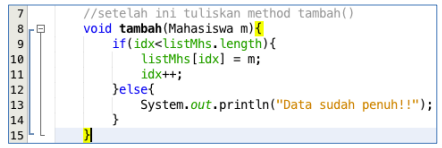
6. Tambahkan method tampil() di dalam class tersebut! Method tampil() digunakan untuk menampilkan semua data mahasiswa-mahasiswa yang ada di dalam class tersebut! Perhatikan penggunaan sintaks for yang agak berbeda dengan for yang telah dipelajari sebelumnya, meskipun secara konsep sebenarnya mirip.
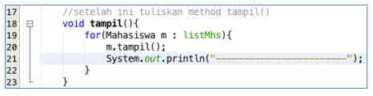
7. Tambahkan method bubbleSort() di dalam class tersebut!
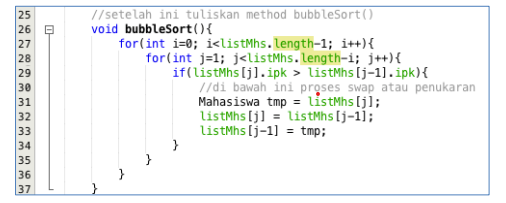
8. Buat class Main dan didalamnya buat method main() seperti di bawah ini!

9. **Di dalam method main()**, buatlah sebuah objek DaftarMahasiswaBerprestasi dan buatlah 5 objek mahasiswa kemudian tambahkan semua objek mahasiswa tersebut dengan memanggil fungsi tambah pada objek DaftarMahasiswaBerprestasi. Silakan dipanggil fungsi tampil() untuk melihat semua data yang telah dimasukan, urutkan data tersebut dengan memanggil fungsi bubbleSort() dan yang terakhir panggil fungsi tampil kembali.
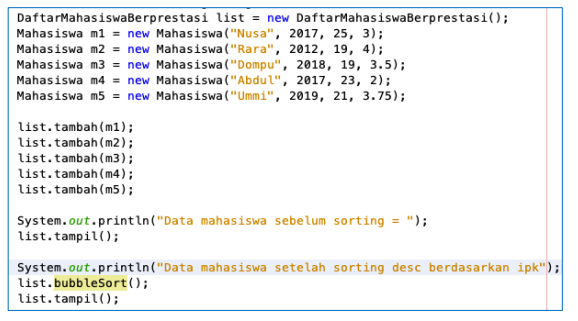

>Source code Mahasiswa (object) :
```java

public class Mahasiswa {

    int thnMasuk, umur;
    String nama;
    double ipk;

    Mahasiswa(String n, int t, int u, double i){
        nama = n;
        thnMasuk = t;
        umur = u;
        ipk = i;
    }

    void tampil(){
        System.out.println("Nama = "+nama);
        System.out.println("Tahun masuk = "+thnMasuk);
        System.out.println("Umur = "+umur);
        System.out.println("IPK = "+ipk);
    }
}
```
>Source code DataMahasiswaBerprestasiClass (object) :
```java

public class DaftarMahasiswaBerprestasi {
    Mahasiswa listMhs[] = new Mahasiswa[5];
    int idx;

    void tambah(Mahasiswa m) {
        if (idx < listMhs.length) {
            listMhs[idx] = m;
            idx++;
        } else {
            System.out.println("Maaf data sudah penuh :(");
        }
    }

    void tampil() {
        for (Mahasiswa m : listMhs) {
            m.tampil();
            System.out.println("===============================");
        }
    }

    void bubbleSort(){
        for(int i=o;i<listMhs.length-1;i++){
            for(int j=1;j<listMhs.length-i;j++){
                if(listMhs[j].ipk>listMhs[j-1].ipk){
                    Mahasiswa tmp = listMhs[j];
                    listMhs[j] = listMhs[j-1];
                    listMhs[j-1] = tmp;
                }
            }
        }
    }

    void selectionSort(){
        for(int i=0;i<listMhs.length-1;i++){
            imt idxMin = i;
            for(int j=i+1;j<listMhs.length;j++){
                if(listMhs[j].ipk<listMhs[idxMin].ipk){
                    idxMin = j;
                }
            }Mahasiswa tmp = listMhs[idxMin];
            listMhs[idxMin] = listMhs[i];
            listMhs[i] = tmp;
        }
    }

    void insertionSort(){
        for(int i=0;i<listMhs.length;i++){
            Mahasiswa temp = listMhs[i];
            int j = i;
            while (j>0 && listMhs[j-1].ipk>temp.ipk){
                listMhs[j] = listMhs[j-1];
                j--;
            }listMhs[j] = temp;
        }
    }
}
```
>Source code MainMahasiswa (main) :
```java

import java.util.Scanner;

public class MainMahasiswa {
    public static void main(String[] args) {
        Scanner sc = new Scanner(System.in);
        DaftarMahasiswaBerprestasi list = new DaftarMahasiswaBerprestasi();
        Mahasiswa m1 = new Mahasiswa("Nusa", 2017, 25, 3);
        Mahasiswa m2 = new Mahasiswa("Rara", 2012, 19, 4);
        Mahasiswa m3 = new Mahasiswa("Dompu", 2018, 19, 3.5);
        Mahasiswa m4 = new Mahasiswa("Abdul", 2017, 23, 2);
        Mahasiswa m5 = new Mahasiswa("Ummi", 2019, 21, 3.75);

        list.tambah(m1);
        list.tambah(m2);
        list.tambah(m3);
        list.tambah(m4);
        list.tambah(m5);

        System.out.println("Data mahasiswa sebelum sorting = ");
        list. tampil();

        System.out.println("Data Mahasiswa setelah sorting desc berdasarkan ipk");
        System.out.print("pilih metode 1.Bubble sort, 2.Selection sort, 3.Insertion sort");
        int pilih = sc.nextInt();
        if (pilih == 1){
            list.bubbleSort();
            list.tampil();
        } else if(pilih == 2){
            list.selectionSort();
            list.tampil();
        }else if(pilih == 3){
            list.insertionSort();
            list.tampil();
        }
    }
}
```

>Hasil Output :


---
#### 5.2.2 Verifikasi Hasil Percobaan
Cocokan hasilnya dengan yang terdapat pada tampilan di bawah ini


---
#### 5.2.3 Pertanyaan
1. Terdapat di method apakah proses bubble sort?

    **Ada di method void bubbleSort()**
2. Terdapat di method apakah proses selection sort?

    **Ada di method void selectionSort()**
3. Apakah yang dimaksud proses swap? Tuliskan potongan program untuk melakukan proses swap tersebut!

    **Proses memindahkan nilai antara 2 index dengan cara menambahkan 1 variable untuk wadah pindah**
>bubbleSort :
    void bubbleSort(){
        for(int i=o;i<listMhs.length-1;i++){
            for(int j=1;j<listMhs.length-i;j++){
                if(listMhs[j].ipk>listMhs[j-1].ipk){
                    Mahasiswa tmp = listMhs[j];
                    listMhs[j] = listMhs[j-1];
                    listMhs[j-1] = tmp;
                }
            }
        }
    }

>selectionSort :
    void selectionSort(){
        for(int i=0;i<listMhs.length-1;i++){
            imt idxMin = i;
            for(int j=i+1;j<listMhs.length;j++){
                if(listMhs[j].ipk<listMhs[idxMin].ipk){
                    idxMin = j;
                }
            }Mahasiswa tmp = listMhs[idxMin];
            listMhs[idxMin] = listMhs[i];
            listMhs[i] = tmp;
        }
    }

4. Di dalam method bubbleSort(), terdapat baris program seperti di bawah ini:

Untuk apakah proses tersebut?

    **program diatas digunakan untuk proses swap atau penukaran(BubbleSort), dengan menambahkan variable tmp sebagai wadah**
5. Perhatikan perulangan di dalam bubbleSort() di bawah ini:
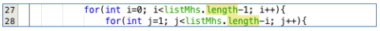
    - Apakah perbedaan antara kegunaan perulangan i dan perulangan j? 

        **Outer : i,
        Berfungsi agar pengurutan terus berjalan hingga semua terurut**

        **Inner : j,
        Berfungsi melakukan pengecekan dan pertukaran nilai secara berulang hingga urut**
    - Mengapa syarat dari perulangan i adalah i<listMhs.length-1?

        **Karena yang diminta untuk di outputkan di data itu berjumlah 4, jadi karena length atau panjang dari mahasiswanya 5 maka perlu dikurangi 1 agar outputnya bisa 4.**

    - Mengapa syarat dari perulangan j adalah j<listMhs.length-i?

        **agar batas dari perulangan j (perulangan dalam) memiliki rentang panjang sejumlah panjang array listMhs dikurangi i ketika melakukan swapping / penukaran nilai dari array listMhs agar bisa urut.**

    - Jika banyak data di dalam listMhs adalah 50, maka berapakali perulangan i akan berlangsung? Dan ada berapa Tahap bubble sort yang ditempuh?

        **perulangan i akan berlangsung sebanyak 49 kali dan untuk tahapan bubble sort bergantung pada situasi indeks tersebut**

---
### 5.3 Mengurutkan Data Mahasiswa Berdasarkan IPK Menggunakan Selection Sort
Jika pada praktikum yang sebelumnya kita telah mengurutkan data mahasiwa berdasarkan IPK menggunakan Bubble Sort secara descending, pada kali ini kita akan mencoba untuk menambahkan fungsi pengurutan menggunakan Selection Sort.

---
#### 5.3.1. Langkah-langkah Percobaan.
1. Lihat kembali class DaftarMahasiswaBerprestasi, dan tambahkan method selectionSort() di dalamnya! Method ini juga akan melakukan proses sorting secara ascending, tetapi menggunakan pendekatan selection sort.
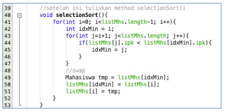
2. Setelah itu, buka kembali class Main, dan di dalam method main() tambahkan baris
program untuk memanggil method selectionSort() tersebut!
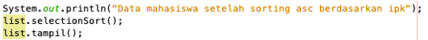
3. Coba jalankan kembali class Main, dan amati hasilnya! Apakah kini data mahasiswa telah
tampil urut menaik berdasar ipk?

    **Adalah benar**
>Hasil Output :


---
#### 5.3.2. Verifikasi Hasil Percobaan
Pastikan output yang ditampilkan sudah benar seperti di bawah ini


---
#### 5.3.3. Pertanyaan
Di dalam method selection sort, terdapat baris program seperti di bawah ini:
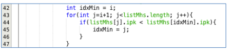
Untuk apakah proses tersebut, jelaskan!

- **int idxMin = i digunakan untuk data pada index ke i;** 
- **for(int j=i+1; j<listMhs.length; j++)  digunakan untuk startnya disebelahnya i atau data setelahnya i hingga akhir;**
- **if(listMhs[j].ipk < listMhs[idxMin].ipk) digunakan untuk membandingkan apakah nilai idxMin lebih besar dari listMhs[j];**
- **idxMin = j; digunakan untuk j menjadi nilai baru dari idxMin.**

---
### 5.4 Mengurutkan Data Mahasiswa Berdasarkan IPK Menggunakan Insertion Sort
Yang terakhir akan diimplementasikan Teknik sorting menggunakan Insertion Sort, dengan mengurutkan IPK mahasiswa secara ascending.

---
#### 5.4.1 Langkah-langkah Percobaan
1. Lihat kembali class DaftarMahasiswaBerprestasi, dan tambahkan method insertionSort() di dalamnya. Method ini juga akan melakukan proses sorting secara ascending, tetapi menggunakan pendekatan Insertion Sort.
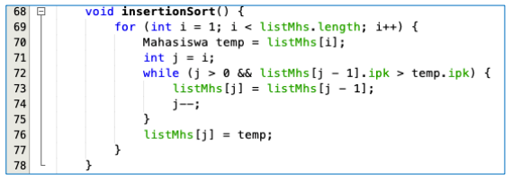
2. Setelah itu, buka kembali class Main, dan di dalam method main() tambahkan baris program untuk memanggil method insertionSort() tersebut!
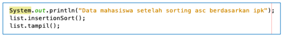
3. Coba jalankan kembali class Main, dan amati hasilnya! Apakah kini data mahasiswa telah tampil urut menaik berdasar ipk?

    **Adalah benar**
>Hasil Output :


---
#### 5.4.2 Verifikasi Hasil Percobaan
Pastikan output yang ditampilkan sudah benar seperti di bawah ini


---
#### 5.4.3 Pertanyaan
Ubahlah fungsi pada InsertionSort sehingga fungsi ini dapat melaksanakan proses sorting dengan cara ascending atau decending, anda dapat melakukannya dengan menambahkan parameter pada pemanggilan fungsi insertionSort.
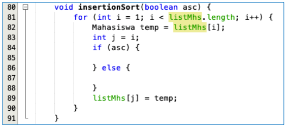

>Source code DataMahasiswaBerprestasiClass :
```java

public class DaftarMahasiswaBerprestasi {
    Mahasiswa listMhs[] = new Mahasiswa[5];
    int idx;

    void tambah(Mahasiswa m) {
        if (idx < listMhs.length) {
            listMhs[idx] = m;
            idx++;
        } else {
            System.out.println("Maaf data sudah penuh :(");
        }
    }

    void tampil() {
        for (Mahasiswa m : listMhs) {
            m.tampil();
            System.out.println("===============================");
        }
    }

    void bubbleSort(){
        for(int i=o;i<listMhs.length-1;i++){
            for(int j=1;j<listMhs.length-i;j++){
                if(listMhs[j].ipk>listMhs[j-1].ipk){
                    Mahasiswa tmp = listMhs[j];
                    listMhs[j] = listMhs[j-1];
                    listMhs[j-1] = tmp;
                }
            }
        }
    }

    void selectionSort(){
        for(int i=0;i<listMhs.length-1;i++){
            imt idxMin = i;
            for(int j=i+1;j<listMhs.length;j++){
                if(listMhs[j].ipk<listMhs[idxMin].ipk){
                    idxMin = j;
                }
            }Mahasiswa tmp = listMhs[idxMin];
            listMhs[idxMin] = listMhs[i];
            listMhs[i] = tmp;
        }
    }

    void insertionSort(){
        for(int i=0;i<listMhs.length;i++){
            Mahasiswa temp = listMhs[i];
            int j = i;
            while (j>0 && listMhs[j-1].ipk>temp.ipk){
                listMhs[j] = listMhs[j-1];
                j--;
            }listMhs[j] = temp;
        }
    }
}
```
>Source code Main :
```java
import java.util.Scanner;

public class MainMahasiswa {
    public static void main(String[] args) {
        Scanner sc = new Scanner(System.in);
        DaftarMahasiswaBerprestasi list = new DaftarMahasiswaBerprestasi();
        Mahasiswa m1 = new Mahasiswa("Nusa", 2017, 25, 3);
        Mahasiswa m2 = new Mahasiswa("Rara", 2012, 19, 4);
        Mahasiswa m3 = new Mahasiswa("Dompu", 2018, 19, 3.5);
        Mahasiswa m4 = new Mahasiswa("Abdul", 2017, 23, 2);
        Mahasiswa m5 = new Mahasiswa("Ummi", 2019, 21, 3.75);

        list.tambah(m1);
        list.tambah(m2);
        list.tambah(m3);
        list.tambah(m4);
        list.tambah(m5);

        System.out.println("Data mahasiswa sebelum sorting = ");
        list. tampil();

        System.out.println("Data Mahasiswa setelah sorting desc berdasarkan ipk");
        System.out.print("pilih metode 1.Bubble sort, 2.Selection sort, 3.Insertion sort");
        int pilih = sc.nextInt();
        if (pilih == 1){
            list.bubbleSort();
            list.tampil();
        } else if(pilih == 2){
            list.selectionSort();
            list.tampil();
        }else if(pilih == 3){
            list.insertionSort();
            list.tampil();
        }
    }
}
```
>Hasil Output :


---
### 5.5 Latihan Praktikum
Sebuah yang bergerak dalam bidang penjualan tiket pesawat sedang mengembangkan backend untuk sistem pemesanan tiket, salah satu fiturnya adalah menampilkan daftar tiket yang tersedia berdasarkan pilihan filter yang diinginkan user. Daftar tiket ini harus dapat di sorting berdasarkan harga dimulai dari harga termurah ke harga tertinggi. Implementasikanlah class diagram berikut ini kedalam bahasa pemrograman java kemudian buatlah proses sorting data untuk harga tiket menggunakan algoritma bubble sort dan selection sort. 


